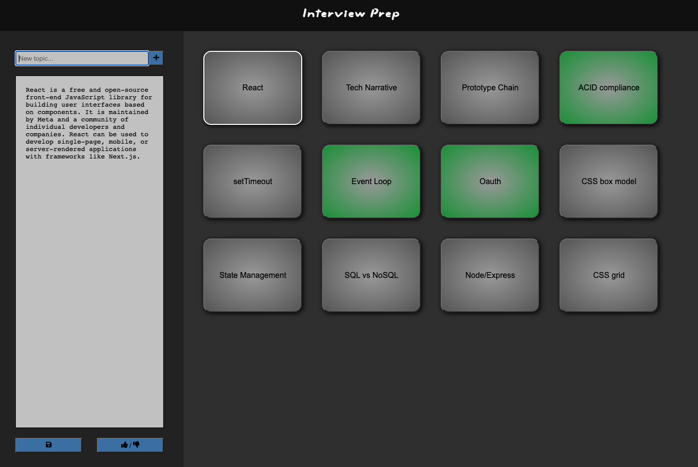

Welcome to Interview Prep Beta!

A simple way to visualize your software engineer interviewing journey.

Let's get into how you can use this repo:

1. Fork or clone this repo onto your local machine.
2. npm install
3. npm run dev
4. The application should now be running on localhost:8080 in browser

- To add new topics/questions simply use the input field and click the '+' button.
- The new topic/question card will now be displayed on the board to the right.
- To add or edit any notes for a topic just select that topic card, and edit the textarea in the dashboard to the left.
- You then need to click the save button to save the notes to that topic card.
- To indicate that you're happy with your notes about that subject, select that topic card and click the thumbs up/thumbs down button.
- At any time you can undo this feature for a topic card to indicate your notes need some work.

No database is set up for this application. Instead, it uses the 'db.json' file located in the repo to store your information.
If at anytime you want to clear your board, simply replace everything in your 'db.json' file with an empty object '{}'.
There is currently no delete feature.

I hope this helps any fellow software engineers land there next dream career!
