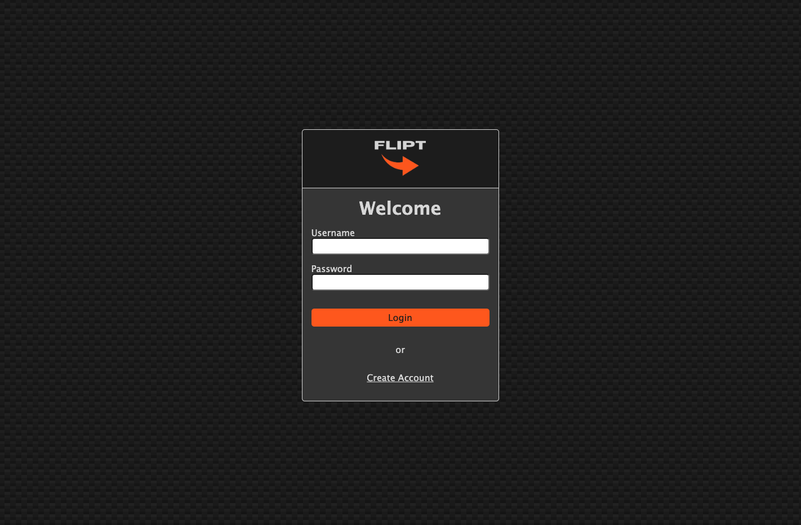
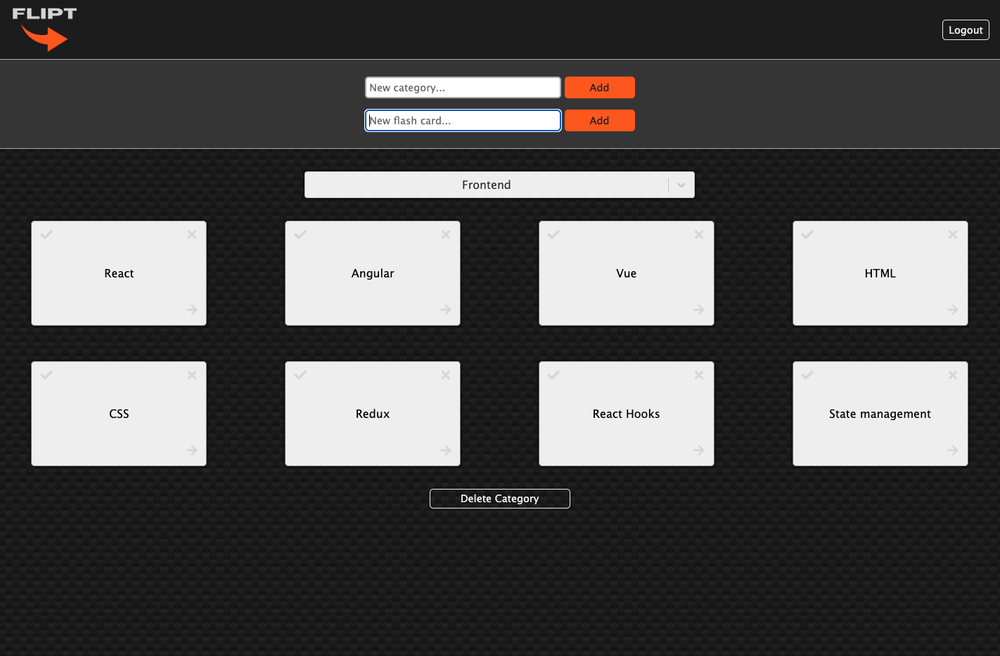

# Flipt

It's here! Flipt has arrived! An application that uses flash cards to help you learn or study. You create the categories. You create the topics. And you create the answers or notes. It's an organized way for you to categorize any topics you want to study in a visual way. What's even better? It's also mobile friendly so you can take your studying on the go!

## To get started
1. Follow this [link](https://flipt-9463a12dabc6.herokuapp.com/) to the web app!
2. If this is your first time, create a new account. Otherwise simply login.
3. By now you should be logged in. Now you can add categories and then any flash cards to those categories.

### Details
* When a flash card is made you'll notice three buttons on the front of the flash cards.
  * The '✓' button is a toggle and indicates when you're satisfied with the answer you've provided. You can uncheck a flash card as well.
  * The '✘' button will permanently delete that flash card.
  * The '→' button will flip the card over so you can provide an answer or notes.
* When on the back of the flash card you can type any answers or notes in the textarea.
  * To save your answers and notes, simply click the 'SAVE' button.
* At the bottom of a category section there is a button that will allow you to delete that entire category.
* And finally, to logout simply click the logout button at the top right.

## Caution!
You may only have one flash card flipped over at a time. If you flip over another flash card before saving the current flash card, your answers or notes on that flash card will not be saved.

## Screenshots

